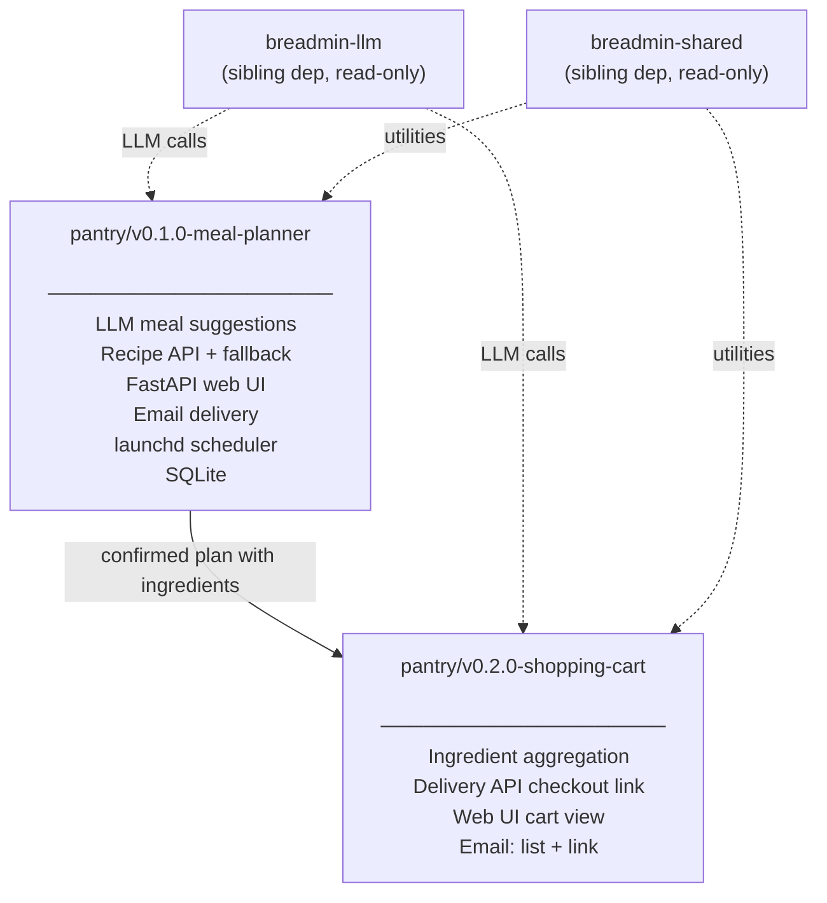

# pantry — Dependency Graph

## Notes

- pantry is fully standalone — no dependency on moot, breadmin-jobman, or breadwinner
- `breadmin-llm` and `breadmin-shared` are consumed as read-only sibling deps; no changes required to those repos
- v0.2.0 is blocked on the P1 Key Unknown in v0.1.0: grocery delivery API access (Instacart Connect or alternative) must be resolved before v0.2.0 design can begin
